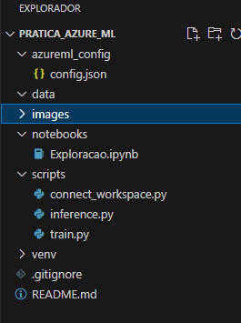
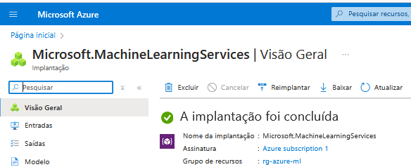
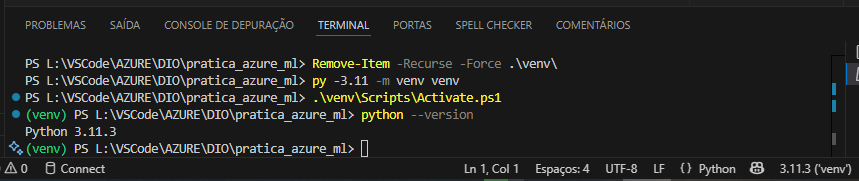
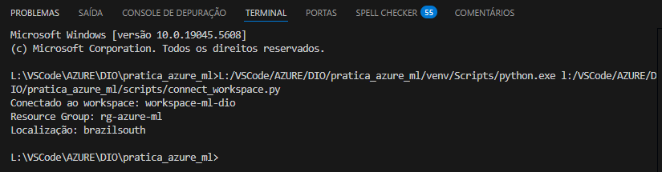
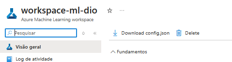
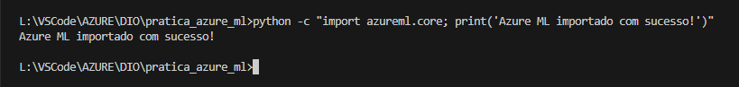
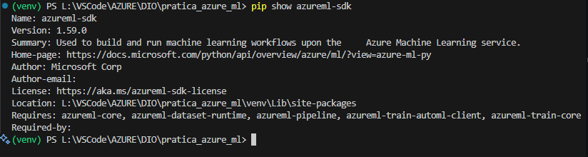

# 📊 Explorando o Azure Machine Learning e Conexão com Workspace 🐍

## 🎯 Objetivo

Este projeto foi desenvolvido para **explorar** e **demonstrar** o uso do [Azure Machine Learning](https://azure.microsoft.com/products/machine-learning) (AML) em conjunto com um ambiente Python local. Ele abrange:

- **Criação de um workspace** no Azure.
- **Configuração** de um ambiente virtual Python (3.11).
- **Instalação** do SDK do Azure ML (`azureml-sdk`).
- **Conexão** ao workspace via arquivo `config.json`.
- **Organização** do projeto em pastas (scripts, notebooks, data, etc.).
- **Documentação** das etapas para que estudantes e profissionais possam reproduzir o processo.

## 🏗️ Estrutura do Projeto

O projeto segue uma estrutura modular, facilitando a manutenção e a colaboração:

- **azureml_config/**  
  Contém o arquivo `config.json` baixado do Portal do Azure, que armazena informações para conexão ao workspace.

- **data/**  
  Armazena arquivos CSV ou outros datasets que possam ser utilizados em experimentos de Machine Learning.

- **images/**  
  Guarda capturas de tela (screenshots) e recursos visuais para documentação.

- **notebooks/**  
  Contém notebooks (`.ipynb`) para exploração, análise de dados e experimentos interativos no AML ou localmente.

- **scripts/**  
  - **connect_workspace.py**: Script que exemplifica a conexão ao workspace do Azure ML usando o `config.json`.  
  - **train.py**: Exemplo de script de treinamento de um modelo de Machine Learning localmente.  
  - **inference.py**: Exemplo de script para carregar um modelo e realizar inferências.

- **venv/**  
  Ambiente virtual Python contendo dependências instaladas (não incluído no repositório, pois está no `.gitignore`).

- **.gitignore**  
  Arquivo que lista itens a serem ignorados pelo Git (por exemplo, `venv/`, arquivos temporários, etc.).

- **README.md**  
  Documento principal com instruções de uso e detalhes do projeto (este arquivo).

## 🗂️ Fluxo de Dados e Funcionalidades

1. **Criação do Workspace no Azure**  
   - O usuário acessa o Portal do Azure, cria um **Resource Group** e, dentro dele, um **Azure ML Workspace**.

2. **Download do `config.json`**  
   - No Portal ou no AML Studio, clica em **“Download config.json”** para obter as credenciais do workspace.

3. **Configuração Local**  
   - Cria um ambiente virtual Python (3.11).
   - Instala o `azureml-sdk` e bibliotecas auxiliares (`pandas`, `scikit-learn`, etc.).
   - Posiciona o `config.json` em `azureml_config/config.json`.

4. **Conexão ao Workspace**  
   - O script `connect_workspace.py` lê o `config.json` e autentica no Azure via **login interativo**.
   - Confirma a conexão exibindo o nome do workspace, resource group e localização.

5. **Treinamento / Inferência**  
   - Scripts como `train.py` e `inference.py` podem ser executados localmente ou adaptados para enviar jobs ao AML.

## 💻 Tecnologias e Bibliotecas Utilizadas

- **Python 3.11**: Versão recomendada para compatibilidade com o Azure ML SDK.
- **azureml-sdk**: Biblioteca principal para interação com o Azure Machine Learning (criação de experimentos, registro de modelos, etc.).
- **pandas** e **scikit-learn**: Exemplos de bibliotecas comuns para manipulação de dados e criação de modelos de ML.
- **matplotlib** (opcional): Para visualização de dados.
- **pip / venv**: Gerenciamento de pacotes e ambiente virtual no Python.

## 🚀 Modo de Uso

### 1. Pré-requisitos

- Conta gratuita no [Azure](https://azure.microsoft.com/free) e um **Azure ML Workspace** criado.
- `config.json` baixado do Portal e salvo em `azureml_config/`.

### 2. Criar e Ativar Ambiente Virtual

- Windows / PowerShell
python -m venv venv
.\venv\Scripts\activate

- (ou Git Bash)
source venv/Scripts/activate

### 3. Instalar Dependências

pip install --upgrade pip setuptools wheel
pip install azureml-sdk pandas scikit-learn

### 4. Conectar ao Workspace

python scripts/connect_workspace.py

1. Será exibida uma URL para login no Azure.
2. Após autenticar, você verá a mensagem:

Conectado ao workspace: <nome_do_workspace>
Resource Group: <resource_group>
Localização: regiao>

### 5. Executar Scripts de Treino/Inferência

- Treinamento:
python scripts/train.py

- Inferência:
python scripts/inference.py

## 🗂️ Estrutura de Pastas

## 🚀 Clonando o Repositório

git clone <https://github.com/IOVASCON/pratica_azure_ml.git>

## 🖼️ Imagens do Desenvolvimento

1. Inscrição Microsoft AZURE:

    

2. Ambiente Virtual Python 3.11.3:

    

3. Conexão Conta Azure ML:

    

4. Download Config.json:

    

5. Importação Biblioteca azureml.core:

    

6. Show AzureML-SDK:

    

🚀 Clonando o Repositório

git clone <https://github.com/IOVASCON/pratica_azure_ml.git>

## 🤝 Contribuições

Contribuições são muito bem-vindas! Se você encontrar problemas ou tiver sugestões de melhorias:

- Abra uma issue para relatar o problema ou sugerir novas funcionalidades.
- Envie um pull request com suas contribuições.

## 👤 Autor

[Izairton] - [IOVASCON](https://github.com/IOVASCON)

✨ Melhorias Futuras

- Integração com Pipelines no Azure ML, permitindo enviar jobs de treinamento para a nuvem.
- Registro de modelos e criação de endpoints de inferência gerenciados pelo AML.
- Dashboards de monitoramento no Azure, incluindo logs e métricas de experimentos.
- Automação com GitHub Actions ou Azure DevOps para CI/CD.
- Suporte a versões adicionais de Python (3.9, 3.10), conforme compatibilidade.
